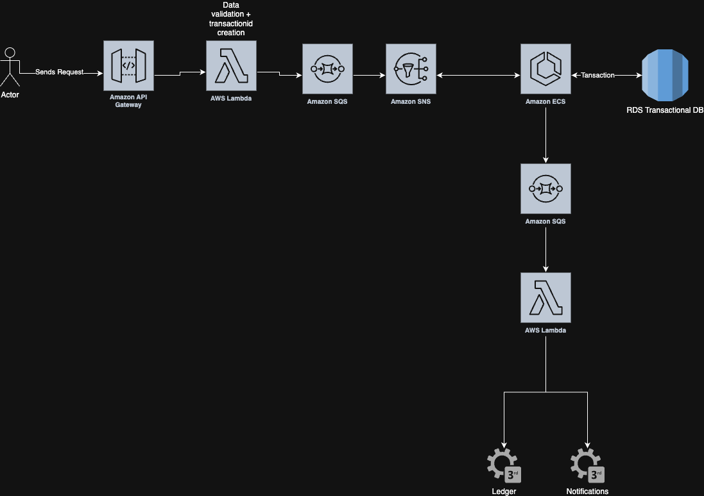

# System Design Scenario: Cashout System (Event-Driven Architecture)

**Scenario:**  
You work at a sports betting company. Users place bets on live games. You need to build a **cashout service** that lets users withdraw part of their bet if they’re no longer confident.

### Requirements:
- Users can request a cashout **any time before the game ends**
- The system evaluates whether a cashout is valid, and how much to refund
- If valid, the cashout is processed (partial refund) and recorded
- Cashouts must be idempotent
- Multiple teams (e.g., Ledger, Notifications) must be informed of a successful cashout
- The system must scale — traffic spikes before big games

### Constraints:
- The rest of the platform uses **event-driven architecture**
- You must build the system so it **emits events**, not just updates state
- Assume you’re in AWS. Use whatever services make sense.
- Code not required — this is pure architecture

---

## My Response

### System Description

- The user submits a cashout request via a frontend, which hits **Amazon API Gateway**
- API Gateway routes the request to an **AWS Lambda** for lightweight validation and **transaction ID creation**
- The validated request is sent to **Amazon SQS** for buffering and passed to **Amazon SNS**
- **Amazon ECS** picks up the message from SNS and handles the **cashout business logic**, including DB interaction
- The **transactional RDS database** ensures atomicity of financial operations
- Upon successful processing, ECS publishes a result event
- This event is sent to a downstream **SQS queue**, consumed by **another AWS Lambda**
- Lambda then fans out the result to **Ledger** and **Notification** third-party systems

### Resilience Features

- Idempotency is enforced on the consumer side
- FIFO queues are used along with deduplication IDs
- Each transaction is tracked in the DB to prevent double-processing

---

## 🖼️ Architecture Diagram

