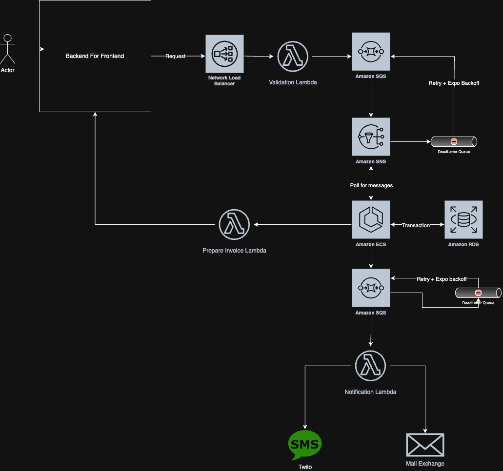

# System Design Scenario: Invoice Payment Processing System (Event-Driven Architecture)

## 📄 Prompt

**Scenario:**  
You’re building a backend system for a B2B platform. Clients can pay invoices through multiple channels (bank transfer, credit card, third-party APIs). Once an invoice is paid, multiple internal systems must be notified.

### Requirements:
- Clients can pay an invoice via API or through an uploaded payment confirmation
- When a payment is received:
  - The invoice must be marked as paid
  - A receipt must be generated
  - The customer ledger must be updated
  - Notifications must be sent (email/SMS)
- Payments may be **re-submitted** due to latency or duplication (idempotency is critical)
- All actions must be **auditable**
- External APIs (like the payment gateway) may return **late** confirmations or fail intermittently

### Constraints:
- Must use event-driven architecture
- System must handle **retries, eventual consistency, and non-blocking flows**
- All critical state lives in a transactional DB (RDS)
- Service must scale under high volume and multiple payment processors

---

## 🖼️ Architecture Diagram

---

## ❓ Interview Questions + Candidate Responses

### 1. What happens if the Validation Lambda fails intermittently or throws due to malformed requests?

**Answer:** Ah you're right, we should have another DLQ here.

---

### 2. The ECS service polls from SNS — how do you guarantee that each invoice is only processed once?

**Answer:** We're going create a transaction Id, check that transaction Id on the consumer to make sure we haven't used it. We're also going to use FIFO queues here with deduplication of IDs.

---

### 3. Let's say the Notification Lambda is temporarily down. What happens to the messages?

**Answer:** Perhaps we should have something here to cache the messages with a Time to Live. You could possibly use DynamoDB.

---

### 4. What’s the role of the Prepare Invoice Lambda, and why does it loop back into the BFF?

**Answer:** This is sending back a webhook to the "app" user is using containing the invoice. The BFF contains both the frontend logic and any APIs used. I think it's safer to have this separation.

---

### 5. Why use SNS → ECS instead of just SQS → ECS?

**Answer:** SQS → ECS would mean that messages are being sent and the application automatically has to scale to the flow of data through SQS to ECS.  
If you have the application polling, you can control the flow of messages, and the creation of threads if needed. Perhaps in a timely system, SQS → ECS might make sense, but the ECS has to be able to scale.

---

### 6. How would you monitor and alert on failures in this flow?

**Answer:** CloudWatch. I would have alerting on the validation lambda, ECS, Prepare invoice lambda, Notification lambda, and DLQ alerting.  
Thresholds: For the validation lambda it would be dependent on the quality of data from the BFF.  
If we control the BFF, great, otherwise we would set a threshold around expected error rate.  
You could have a secondary system for storing errors in a DynamoDB to investigate and fix.  
ECS I would have alerting setup for database outages, and create a threshold if one transaction has to be rolled back, or if the database is completely offline.  
Notification Lambda I would create alerting for the failure to send notifications to the notification service.  
If exponential backoff exceeds a certain limit, create a high priority alert. Again, some caching + TTL of notifications might be useful here.  
And for invoice, much the same as Notification Lambda.  
I would log from the Lambdas right where we send events to other services, so that the time and context is accurately logged.

---

### 7. Where would you enforce authentication and input validation?

**Answer:** Authentication in my view would be a separately modelled system.  
The user would authenticate their login. The backend for the BFF would be authenticated using OAuth2, but in this situation I am assuming they are already authenticated using the OAuth2 system.  
Usually though, the OAuth2 would be done behind the load balancer.  
I haven't done OAuth2 before in systems, so my understanding here is loose.

---

### 8. Where does transaction atomicity end?

**Answer:** After downstream actions.

---

### 9. The ECS would have to send off notifications or invoices until after the transaction has completed.

---

Time to complete: 50 minutes

