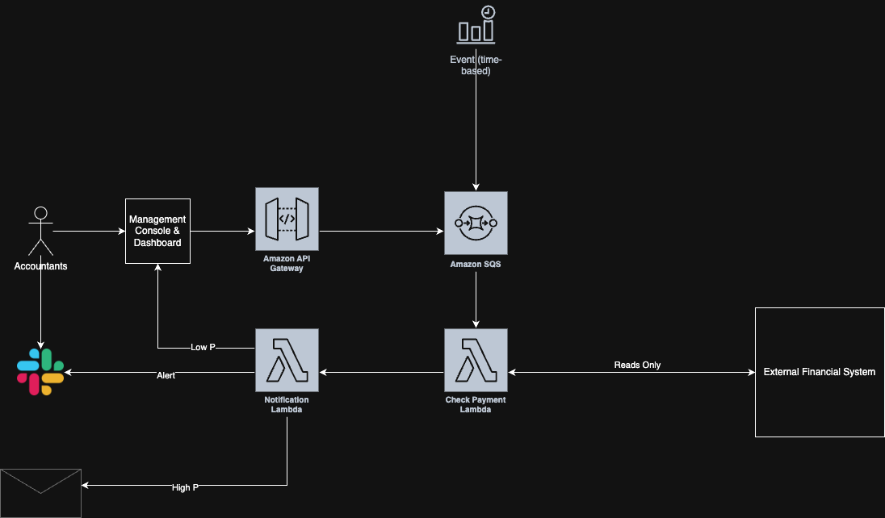

# System Design Scenario: Reconciliation System (Event-Driven Architecture)

## 📄 Prompt

**Scenario:**  
You’re working at a financial services company. One team comes to you and says:  
“We need a reconciliation system. Sometimes we receive data from partners, and it doesn't match our internal records.  
We need a way to process and flag mismatches.”

---

## ❓ Clarifying Questions & Stakeholder Responses
These are my questions to AI acting as the client to clarify what they want.

### Q1: What do you mean by reconciliation?

> “By reconciliation, I mean we get external reports or transactions from partners — like payment processors, logistics services, or banks — and we need to compare that with our internal system of record.

> For example, a partner might say:
> - ‘We paid you $1000 yesterday for invoice #ABC123’
> - But our system only shows $800 received

> So we need to flag mismatches, keep an audit trail, and allow internal teams to review or resolve them later.”

---

### Q2: Does your internal accounting department trigger this, or is it automated?

> “Ideally it should be automated. But the accounting team does want control over the schedule — they might run it daily, weekly, or manually in some cases. The system should flag discrepancies, store them, and make them available for internal resolution. Bonus if it can alert us immediately when something’s obviously wrong.”

---

### Q3: How do you wish to be notified?

> “For critical mismatches — like a high-value invoice that wasn’t paid, or a duplicate payment — we want a real-time alert (Slack or email). For lower-priority discrepancies — like small rounding issues or late payments — we’re fine reviewing those in a dashboard or report. Ideally, your system can: categorize discrepancies, push urgent alerts, and log everything to a system the finance team can access.”

---

## 🖼️ Architecture Diagram

---

## 🧠 Interview Questions + My Responses (Original)

### 1. What data is the Check Payment Lambda comparing?

This data comes from the already existing payment system, which is an internal financial system, where payments are made. I am assuming we do not need to also make the payment system, but instead we might have to interface to that system.  
If there is no clean API, then we would have to directly connect to the database, which is an option we would have to weight up.  
I should have asked what the existing payment processing system was. But I'm making an assumption here that if they can process and store payments from external providers, then there's likely an API I can use. If it's internal in the same AWS cloud, we will just used the database.

---

### 2. Why use SQS instead of triggering the Lambda directly from the time-based event or API Gateway?

I supppose in this situation we could just directly trigger the lambda from API gateway or the eventbridge schedule. However you still may want to use SQS for DLQ and retries.  
If it's approximately a daily event we could just wire into the lambda directly.

---

### 3. Suppose an external financial system reports a duplicate payment. How do you prevent your system from triggering multiple alerts?

Actually, lets also have a dynamodb that stores a checkPaymentId, that is unique to that event. And we can check against the id.  
If we remove SQS, I think this might fix this issue as events will be unique to either the EventBridge schedule or the manually triggered event.

---

### 4. Where is the audit log for mismatches stored?

Again, like in question 3. I would have a dynamodb to store this information. Something like, each event has an associated status.  
If the dashboard needed to be live to access, potentially could then connect the frontend to the dynamodb. Or we could have separate state in the Management Console/Dashboard that is out of sync with the dynamodb.

---

### 5. What if a high-severity alert fails to send (e.g., Lambda or email fails)?

Yeah we should have SQS with DLQ here.

---

### 6. Could this system handle multiple external sources?

I think this system handles notification to the accountant as a step 1. I think step 2 should be we automate the notification to external parties.  
As the accountant has the contacts anyway to let them know.  
Outside of scope basically.

---

### 7. What if an accountant manually initiates reconciliation for a single client or invoice?

The Management console would allow them to hit the API gateway, and then send an event to SQS/Lambda (depending on what's there).

---

### 8. Could other services subscribe to reconciliation results?

Yeah I would use SNS if we had a usecase for other system to subscribe to results.

